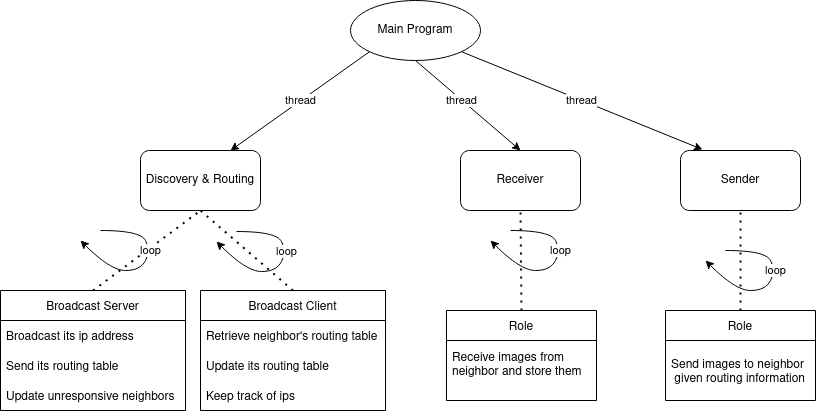
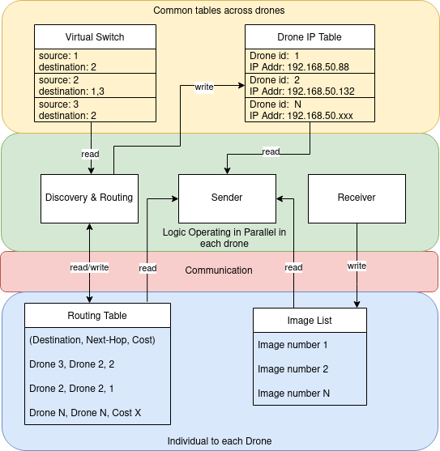
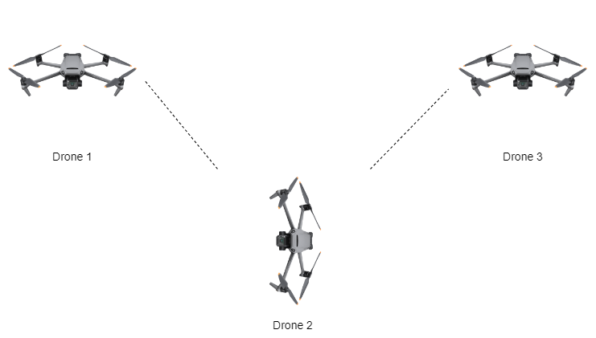
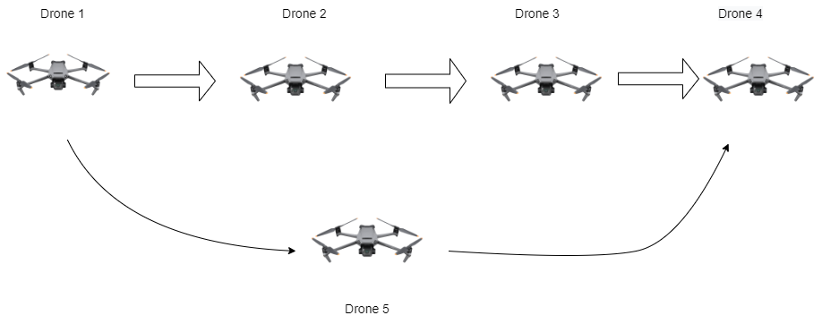

# DroneNet: Implementing a shortest path multi-hop image transfer architecture based on OSPF 

## Motivation
Autonomous unmanned aerial vehicles (UAVs), also called drones, have received increasing interest for environmental and natural disaster monitoring, agriculture surveillance, emergency assistance, and search and rescue missions. Drones are easy to deploy and have low acquisition and maintenance costs. However, drones are limited in their system resources. They generally have low battery levels and weak onboard processing power. To increase the speed and the quantity of data transferred from each drone, a networking scheme has to be developed to increase communication efficiency between the drones. The communication and networking design has to be robust and adaptable to dynamic network topology. 

## Defining the scenario
We define the system as one where a group of drones is released into the field. The goal of the drones is to capture images of the terrain and send the information back to the ground station (GS). The photos are collected at the base station and analyzed by a neural network (YOLOv5 or Faster-RCNN) to extract features relevant to the mission. For example, in traffic control systems, images of cars will be segmented while for search and rescue systems, instances of people will be counted. The drones have to capture high-resolution images. Only one drone is connected to the GS. The rest of the drones have to transfer images from one to another to pass them to the GS.  

## Determining the network requirements
We use the Phantom 4 Pro V2.0 drone as a reference for drone specifications. 
The relevant specifications are shown below. 
- Max speed 45 mph or 20m/s
- 1-inch CMOS camera sensor
- Effective pixels: 20M
- Lens has FOV 84° 8.8 mm/24 mm (35 mm format equivalent)
- microSD max Capacity: 128 GB
- Supported photo formats JPEG, DNG (RAW), JPEG + DNG
- Image size: 3:2 Aspect Ratio: 5472×3648

From the paper, “Deep learning-based object detection in low-altitude UAV datasets: A survey,” we learn that to apply deep learning to images, the drone has to be somewhere between 10-70m in altitude. For the purposes of our project, we use 30m because it is enough to capture images of small objects, such as bottles, human actions, and vehicles. To calculate the network requirements we use the relation between focal length and sensor width is proportional to flight height and observed ground area. We find out that:
- 9MB/2.2s = minimum 4MB/s requirement if the drone flies at max speed 20m/s
- At 20m/s, the drone can cover ~500m sq. 
- One drone can map 300 acres in 60 mins. 
- 10 drones can cover 300 acres in 3.6 mins. 
- 300 acres is about the size of the CU Boulder main campus

## Overview of the capabilites
- Ability to control the drone topology using a json file
- Dynamic discovery of neighbors id numbers and their ip addresses
- Dyanamic calculation of next-hop drone that will be the fastest route to destination
- Removal of a neighbor from the routing table if the neighbor has not responded to a broadcast for a period of time

## Design architecture
The diagrams below provide an overview of the implemented architecture  and algorithm. Each drone runs multiple threads, each one with a specific task. Each thread can write or read certain information through shared json files. 





## How to run the code
Clone the directory to at least two machines which share the same network. Then build the code.
```
cd drone-network
make clean
cmake
```

Prior to running the code, the virtual_switch.json needs to be configured. This defined the communication between various drones. If a machine is running as drone number 1, then the virtual switch file needs to contain an entry for with "source":1. If it communicate with drones number 2 and 3 then it needs to have "destination": "2,3" right under the source. This way the drone knows it can only communicate with two other drones. It will ignore all other ones. 

Repeat this process for any other machine running the code. 

Then you can run the following command on each machine. Make sure the drone number is unique to each machine and matches your desired configuration values in virtual_switch.json:
```
./main <drone numer>
```

## Dynamic updates during runtime
- routing_table.json : The results of the OSPF algorithm are stored here. The drone keeps track of infromation regarding the drones in the network, how to get to them (next-hop), and the cost to get to them. The values get updates when new drones appear or existing dreones disappear. 
- drone_ip.json : The drone needs ip adresses to send and receive files. However, it is not reader-friendly to deal with ip addresses. Therefore each drone stores a conversion map from drone numbers to their ip adresses in these tables. This table is built dynamically via the broadcast client and server. 
- imgs directory : When you would like to transfer a file from one drone to another, then you need to drop some images in the the imgs directory. The sender thread constantly checks this folder to see if anything comes up. When there is an image, a path to the destination, and a way to connect to the next-hop to the destination, then it sends the image. 

## Basic file overview
- main.c - Spawn the broadcast, receiver, and sender threads.
- receiver.c/h - Receive a file from neighboring drone.
- sender.c/h - Send a file to a neighboring drone. 
- broadcast.c/h - Spawn the b_client/b_server threads. 
- b_client.c/h - Request a routing table from any broadcasters. 
- b_server.c.h - Send routing table to any clients after having broadcasted own ip address and drone number.
- create_routing_table.c/h - The main routing algorithm based on OSPF is located here. The routing table gets updated based on the broadcast client data received. This modfifies the routing_table.json which is then sent by the broadcast server. 
- parse_routing_table.c/h - Used to create and modify the drone_ip.json file, as well as to get the next-hop value for the sender.c to figure out which neighbor to send the image to.
- parse_virtual_switch.c/h - Functions that parse the virtual_switch.json and retreive the allowed neighbors. 
- shared_structs.h - Stores the structs used to communicate between drones, for example to share the routing table, stores mutexes, parameters that can be modified, mutexes and relevant header files. 
- cJSON.c/h - External library used to read and write json file data.

## Parameters that can be modified
- DESTINATION_DRONE_ID : located in shared_structs.h and will define which drone is the destination drone for all the image. 
- THREAD_SLEEP_TIME_S : located in shared_structs.h and will define how much time each thread sleeps within its while loop.  
- MAX_TIME_NEIGHBOR_SILENT : located in shared_structs.h and will define, in seconds, what is the maximum time that one drone can hear nothing from another drone. When this threshold is exceeded then the drone will updated its routing table such that any entries that include the silent drone as next-hope get deleted.

## Results
### Code has been tested with various testing topologies :-
#### With three drones 1, 2 and 3 placed in linear position as depicted in the image below:


- This video demonstrates the transfer of image from drone 1 to drone 2 and finally to drone 3: [linear_transfer_1_2_3](https://drive.google.com/drive/folders/1Z6mlZ10ViU_TeDT_nSIIZ9FK4-VjXCPe)

- This video demonstrates the dynamic updating of Routing table in this linear transfer:
[Routing table updating](https://drive.google.com/drive/folders/1Z6mlZ10ViU_TeDT_nSIIZ9FK4-VjXCPe)

- This video demonstrates the dynamic updating of drone_ip.json file:
[drone_ip_update](https://drive.google.com/drive/folders/1Z6mlZ10ViU_TeDT_nSIIZ9FK4-VjXCPe)

#### When drone 2 disappears from this linear network, as depicted in the image below:


- Consequently, this video demonstrates the updating of routing table on disappearance of drone 2: [linear_network_drone_2_disappearing](https://drive.google.com/drive/folders/1Z6mlZ10ViU_TeDT_nSIIZ9FK4-VjXCPe)

#### Considering another scenario when a linear network of drone 1,2,4 and 3 has a new entry. The drone 5 is a lower cost path to destination drone 3 from source drone 1. The image below depicts the same scenario:


- This video demonstrates the above mentioned scenario: [drone_5_appearing](https://drive.google.com/drive/folders/1Z6mlZ10ViU_TeDT_nSIIZ9FK4-VjXCPe)
